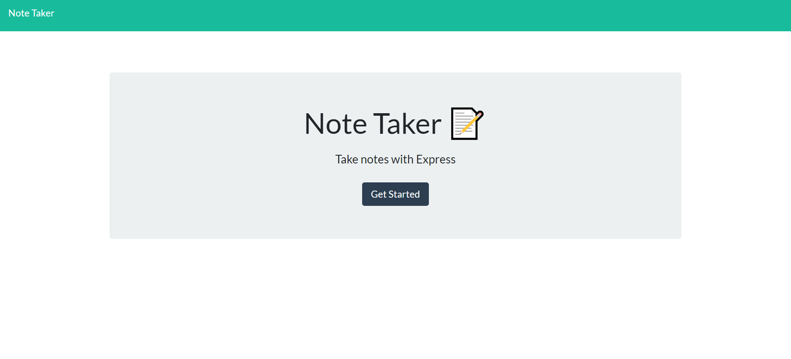

# Express Note Taker 

## Description
This repository houses the program of a _**Express Note Taker**_ which was created using [Node](https://nodejs.org/en/), [Express](https://expressjs.com/) and the [Inquirer](https://www.npmjs.com/package/inquirer?activeTab=readme) dependency, as well as being deployed to [Heroku](https://www.heroku.com/). The program is a simple note taker app which allows a user to customize and save their notes, revisit saved notes, and delete notes. Feel free to visit my program: [Express Note Taker](https://agile-reef-85586.herokuapp.com/)
    

## Table of Contents
* [Installation](#installation)
* [Usage](#usage)
* [Contributions](#contributions)
* [Test Instructions](#test-instructions)
* [License](#license)
* [Questions](#questions)

### Installation 
To install this program, feel free to clone this repository.  You can either set up a server locally and run this program or use this program online through a program like Heroku.

### Usage
To use this program, open the integrated terminal in the directory where this program is cloned to.  Run _**npm start**_ and the program will start.

### Contributions
The main purpose of this repository is to showcase Express and how to use its functionality to create routes so that the frontend code can talk to its server side backend.
### Test Instructions
As for this repository, the frontend code was provided and thus covered its bases.  No testing has been implemented as of this time for the server side.  

### License
This project falls under the license: 

    
### Questions
If you haven't already, and would like to visit my github profile, you can reach me at: https://github.com/DavidESotomayor

Please feel free to reach out to me for any questions, comments, or concerns at : david.elijah.sotomayor@gmail.com

Copyright &copy; David Sotomayor